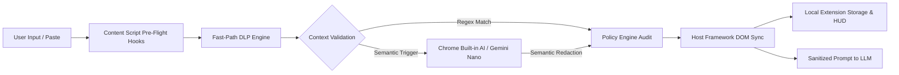

Track: cyber security

Problem: Users risk leaking sensitive credentials, API keys, cloud secrets, and PII to LLM providers like ChatGPT, Claude, and Gemini during prompt submission.

Repository assessment: The solution combines a production-ready client-side WebExtension ("SentinelEdge") with an interactive landing page and JIT masking sandbox demonstration.

What They Built
- A 100% client-side, air-gapped browser extension ("SentinelEdge v3.0") that intercepts user inputs on LLM web interfaces in real time.
- A 3-step hierarchical DLP pipeline combining sub-millisecond regex scanning, contextual window validation, and local AI (Chrome Prompt API / Gemini Nano) fallback.
- Multi-platform input adapters targeting ChatGPT, Claude.ai, Google Gemini, Perplexity, and Microsoft Copilot with host framework state synchronization.
- Pre-flight interception hooks covering paste events, Enter key presses, and submit button clicks with sub-2ms latency performance.
- An enterprise landing page featuring an interactive JIT sandbox demo, user manual, and extension distribution package.

Architecture

Core Capability Check
| Capability | Status | Evidence |
| --- | --- | --- |
| Fast-Path Regex & Contextual DLP Engine | ✅ | `src/core/dlp-engine.ts` |
| Local Semantic AI Interception (Gemini Nano) | ✅ | `src/core/semantic-ai.ts` |
| Policy Audit & Compliance Verification | ✅ | `src/core/policy-engine.ts` |
| Pre-Flight Interception & Multi-LLM Adapter | ✅ | `src/content/index.ts` |
| Host Framework State Synchronization | ✅ | `src/content/FrameworkSync.ts` |
| Interactive Landing Page & JIT Sandbox | ✅ | `ikigai frontend/script.js` |
| Telemetry HUD Popup & Local Audit Logging | ✅ | `src/popup/popup.ts` |

Technical Read
Strongest technical aspect:
 Air-gapped multi-tier interception architecture that combines sub-millisecond contextual regex scanning with local Chrome Gemini Nano AI while maintaining host DOM framework state.

Biggest technical concern:
 Dependency on third-party LLM DOM CSS selectors, which could require ongoing maintenance if host platform markup changes.

Core workflow: Complete
Implementation confidence: High
